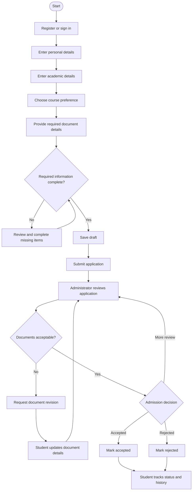
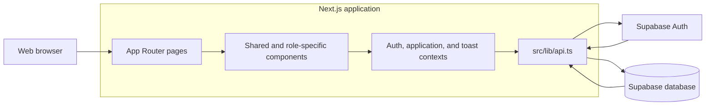
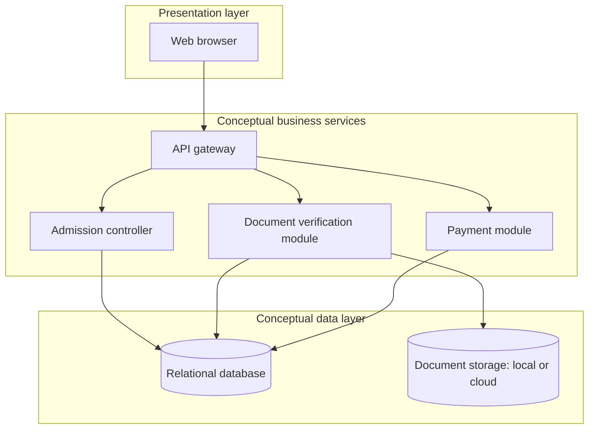
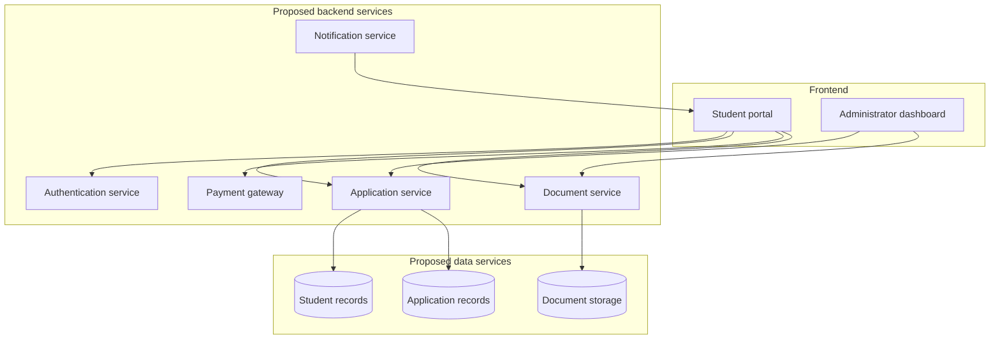
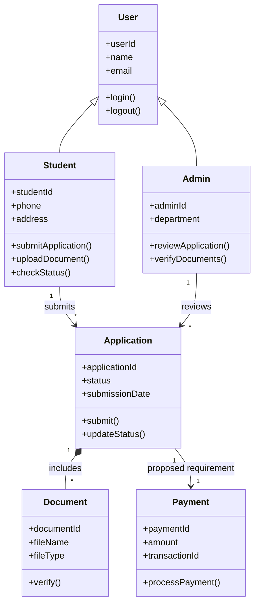
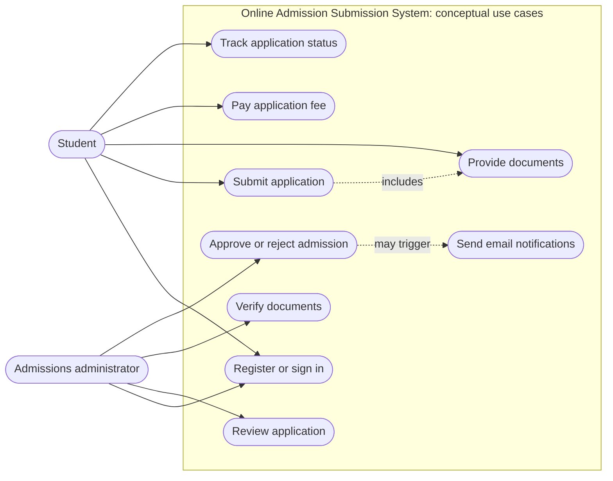
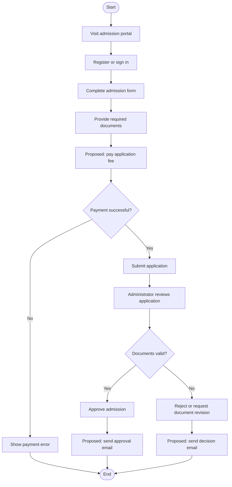

# Admitly — Online Admission Management System

Admitly is a web-based admissions portal that brings student applications and admissions-office review into one interface. Students can create an account, complete an application, provide supporting-document details, save a draft, submit it, and follow its status. Admissions staff can review applications, verify or return documents for revision, record decisions, and view application analytics.

The project was built as a **web development hackathon project**. Its focus is a clear end-to-end admissions experience and a practical demonstration of student and administrator workflows. It is a prototype, not a production admissions service; the current implementation and the planned extensions are described separately below.

## Contents

- [Project goals](#project-goals)
- [Roles and capabilities](#roles-and-capabilities)
- [Application workflow](#application-workflow)
- [Technology](#technology)
- [Architecture and diagrams](#architecture-and-diagrams)
- [Routes](#routes)
- [Project structure](#project-structure)
- [Data and integrations](#data-and-integrations)
- [Getting started](#getting-started)
- [Configuration](#configuration)
- [Demo sign-in](#demo-sign-in)
- [Development commands](#development-commands)
- [Current limitations](#current-limitations)
- [Future scope](#future-scope)

## Project goals

Admissions processes often span forms, document checklists, status updates, and administrative decisions. Admitly explores how these activities can be organized around a single application record with role-specific experiences.

The interface is designed to:

- Guide applicants through personal, academic, course, and document information in manageable steps.
- Preserve unfinished work as a draft and validate information before submission.
- Give students a readable view of document readiness and application progress.
- Give admissions staff an organized queue, applicant details, document-review controls, and decision actions.
- Present application trends through a small administrative analytics dashboard.
- Provide a responsive interface with reusable components, animated transitions, and light and dark themes.

## Roles and capabilities

| Role | Capabilities |
| --- | --- |
| Student | Register or sign in, complete and save an application draft, submit an application, provide document metadata, and view application status and history. |
| Admissions administrator | View application records, inspect applicant and academic details, verify documents, request revisions with a reason, update application status, add internal remarks, and view aggregate analytics. |

The UI uses role guards to keep student and administrator workspaces separate. Authentication and authorization must also be enforced by the configured Supabase project; client-side route guards are not a replacement for database access policies.

## Application workflow

The student application wizard has five steps: personal details, academics, course preference, supporting documents, and review. The form validates relevant fields as applicants progress, saves draft information, and checks for required data and documents before submission.

After submission, an administrator can review the application, verify uploaded-document records, request revisions, or make a decision. Status and document actions are recorded in the application timeline. Students can use the status and documents areas to follow those changes.



The diagram describes the product workflow; it does not imply integrated payment or email services.

## Technology

| Area | Technology |
| --- | --- |
| Web framework | Next.js 15 App Router |
| UI | React 19, TypeScript |
| Styling | Tailwind CSS 4 and project CSS |
| Motion | Framer Motion |
| Icons | Lucide React |
| Authentication and application data | Supabase JavaScript client |
| Form and domain models | Shared TypeScript types, constants, and validation helpers |
| Package manager | npm |

## Architecture and diagrams

### Current implementation architecture

The application is a Next.js client interface backed by a small data-access module. React contexts coordinate authentication, application state, and notifications across the UI. Supabase Auth handles sign-in and registration, while the `profiles` and `applications` tables provide application data. The current document workflow stores document metadata in application records; it does not upload file contents to an object-storage bucket.



### Existing design diagrams

The following diagrams are based on the Mermaid artifacts in [`project_diagrams/`](./project_diagrams/). They capture the broader design concepts documented during the project. They are **conceptual**, not a description of integrated services in the current code. In particular, payment processing, email notifications, a dedicated document-storage service, and a separate backend service layer are not implemented.

#### Conceptual layered architecture

Adapted from [`project_diagrams/architecture.md`](./project_diagrams/architecture.md).



#### Conceptual component diagram

Adapted from [`project_diagrams/component.md`](./project_diagrams/component.md).



#### Conceptual domain model

Adapted from [`project_diagrams/class.md`](./project_diagrams/class.md). The model includes a `Payment` entity for the originally envisioned scope; no payment entity or payment integration is present in the current application types or data-access implementation.



#### Conceptual use cases

Adapted from [`project_diagrams/use_case.md`](./project_diagrams/use_case.md). Payment and email use cases are shown as proposed concepts and are not current application capabilities.



#### Conceptual activity flow

Adapted from [`project_diagrams/activity.md`](./project_diagrams/activity.md). The payment and notification steps represent the original proposed end-to-end process and are not part of the live workflow.



## Routes

| Route | Audience | Purpose |
| --- | --- | --- |
| `/` | Public | Product landing page and overview of the admissions experience. |
| `/login` | Public | Sign in to a student or administrator account. |
| `/register` | Public | Create an account. |
| `/student/dashboard` | Student | Student overview and application summary. |
| `/student/apply` | Student | Multi-step application creation, editing, and submission. |
| `/student/documents` | Student | Review and manage document records. |
| `/student/status` | Student | Follow the application status and timeline. |
| `/admin/dashboard` | Administrator | Administrative overview. |
| `/admin/applications` | Administrator | Search and review application records. |
| `/admin/applications/[id]` | Administrator | Inspect an application, review documents, and make decisions. |
| `/admin/analytics` | Administrator | Review application and course-level metrics. |

## Project structure

```text
src/
  app/                  App Router pages and global styles
    admin/              Administrator routes
    student/            Student routes
    login/              Sign-in page
    register/           Registration page
  components/
    admin/              Application review and analytics components
    auth/               Authentication form and layout
    landing/             Public landing-page sections
    layout/              Navigation, dashboard shell, transitions
    student/             Student dashboard and application workflow
    ui/                  Shared interface primitives
  context/               Authentication, application, and toast state
  hooks/                 Reusable client hooks
  lib/
    api.ts               Supabase-backed data-access functions
    constants.ts         Course, document, and status metadata
    supabase.ts          Supabase client configuration
    validators.ts        Form validation helpers
  types/                 Shared domain and application TypeScript types
project_diagrams/        Conceptual Mermaid diagrams from project design
```

## Data and integrations

`src/lib/api.ts` is the application data-access boundary. It contains operations for authentication, profile retrieval, application listing and lookup, draft saving, submission, document-state changes, administrator decisions, and analytics. React contexts expose the resulting state and actions to pages and components.

The implementation expects a Supabase project with:

- Supabase Auth enabled for account registration and password-based sign-in.
- A `profiles` table containing the user profile fields read by the application: `id`, `name`, `email`, `role`, and `avatar_color`.
- An `applications` table with the application fields used by `src/lib/api.ts`, including applicant and academic data, course preferences, document metadata, timeline, status, and timestamps.
- Appropriate database permissions and row-level security policies for student and administrator access.

The repository does not include database migrations or SQL schema setup. Configure the schema and policies for your Supabase project before using the application with persistent data. Never expose a Supabase service-role key in a browser application; the client uses only the public anon key and relies on database policies to protect records.

Document selection currently records document metadata such as file name and size in the application record. The file bytes are not sent to Supabase Storage or another file service. The payment, email-notification, and dedicated document-storage integrations shown in the conceptual diagrams have not been implemented.

## Getting started

### Prerequisites

- Node.js 20 LTS or another version supported by the installed Next.js 15 release.
- npm.
- A configured Supabase project for authentication and persistent application data.

### Install and run

```bash
npm install
```

Create a `.env.local` file in the repository root and configure the variables described in [Configuration](#configuration). Then start the development server:

```bash
npm run dev
```

Open [http://localhost:3000](http://localhost:3000) in a browser.

## Configuration

Set the following public client configuration in `.env.local`:

```dotenv
NEXT_PUBLIC_SUPABASE_URL=https://your-project-id.supabase.co
NEXT_PUBLIC_SUPABASE_ANON_KEY=your-supabase-anon-key
```

These values are read in `src/lib/supabase.ts`. The application can be built without them, but authentication and database requests require valid values and a configured Supabase schema. The anon key is intended for client use; access to private data must be restricted with Supabase row-level security and suitable policies.

## Demo sign-in

The sign-in page includes quick-login controls prefilled with the following demo credentials:

| Role | Email | Password |
| --- | --- | --- |
| Student | `student@demo.com` | `student123` |
| Administrator | `admin@demo.com` | `admin123` |

These controls submit credentials to Supabase Auth; they do not create demo users or bypass authentication. The accounts must exist in the configured Supabase project, and each must have a matching profile with the appropriate role. Do not reuse these sample credentials for real accounts.

## Development commands

| Command | Purpose |
| --- | --- |
| `npm run dev` | Start the Next.js development server. |
| `npm run build` | Create an optimized production build. |
| `npm run start` | Serve a previously built production application. |
| `npm run lint` | Run ESLint. |

In the current repository state, the lint script is present but ESLint 9 has no `eslint.config.*` file to load, so `npm run lint` exits before analyzing the source. Add a flat ESLint configuration to enable linting.

## Current limitations

- This is a hackathon prototype and has not been represented as a production-ready admissions service.
- Supabase project setup, database schema, and row-level security policies must be configured separately; database migrations are not included.
- The document flow stores metadata only and does not persist uploaded file contents.
- Payment processing and email or other outbound notifications are not integrated.
- Demo sign-in accounts must be provisioned in Supabase Auth and the corresponding profile data must be present.
- Analytics are calculated from the application records returned to the client; production deployments should consider server-side aggregation and access control.
- The conceptual diagrams document a broader target design than the current implementation. The current architecture diagram above describes the implemented client and Supabase integration.

## Future scope

The following roadmap extends the current prototype. It is intentionally shown as future work, not as existing functionality.

```mermaid
flowchart TD
    Current[Hackathon prototype]
    Current --> Foundation[Production foundation]
    Current --> Documents[Document management]
    Current --> Operations[Admissions operations]
    Current --> Experience[Applicant experience]
    Foundation --> Schema[Versioned database migrations]
    Foundation --> Policies[Audited row-level security and role policies]
    Foundation --> Tests[Automated unit, integration, and end-to-end tests]
    Foundation --> Observability[Monitoring, audit logs, and error reporting]
    Documents --> Storage[Private object storage]
    Documents --> UploadSecurity[File type, size, and malware checks]
    Documents --> Retention[Retention and deletion policies]
    Operations --> Notifications[Email and in-app notifications]
    Operations --> Payments[Optional fee and payment reconciliation]
    Operations --> Workflows[Configurable review queues and decision rules]
    Experience --> Accessibility[Accessibility and usability review]
    Experience --> Localization[Additional languages and localization]
    Experience --> Mobile[Mobile-first performance improvements]
```



Future work should be prioritized around data protection and reliable review workflows before introducing optional payment or notification integrations.
